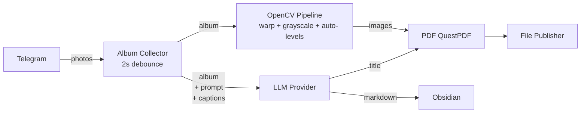

# Paperoni

Paperoni is a background service that ingests photo albums from Telegram, produces AI-written Markdown summaries and document-corrected PDFs, and publishes them to Obsidian and a configurable output directory.

## Pipeline



1. **Telegram Album Collector** — Listens for incoming photo messages. Singles are dispatched immediately; media groups are debounced 2 seconds to form complete **Albums**.
2. **Working Directory** — Each **Album** gets a folder on disk (`{DownloadBasePath}/{messageId}/`) for raw photos, metadata, AI response, and the PDF.
3. **OpenCV Pipeline** — Each **Photo** passes through optional document-detection + perspective warp, grayscale conversion, and histogram-based auto-levels.
4. **AI Summary** — An LLM (OpenAI-compatible, local endpoint) produces a Markdown document with YAML frontmatter (title, date, counterparty, amount, category, tags, etc.).
5. **PDF** — QuestPDF generates an A4 document with processed images, one per page at 1cm margins.
6. **File Publisher (Markdown)** — The Markdown file is copied to a configured Obsidian vault directory.
7. **File Publisher (PDF)** — The PDF is copied to a configured output directory.

## Configuration

Configuration is loaded from `appsettings.json`, user secrets, and environment variables:

| Key | Source | Description |
|-----|--------|-------------|
| `TELEGRAM_BOT_TOKEN` | User secret / env | Telegram bot token |
| `ObsidianOutputPath` | User secret / env | Obsidian vault directory |
| `FilePublisherOutputPath` | User secret / env | Output directory for published PDFs |
| `AI_ENDPOINT` | Env (default: `http://localhost:2276`) | OpenAI-compatible endpoint |
| `AI_MODEL` | Env (default: `qwen-3.6-35b-a3b-q4`) | Model name |
| `PromptFilePath` | `appsettings.json` (default: `Prompt.md`) | Base prompt file path |
| `TestMode` | `appsettings.json` / `appsettings.Development.json` | When `true`, all output routes to `TestModeOutputPath` |
| `TestModeOutputPath` | `appsettings.Development.json` | Test output directory when `TestMode` is `true` |
| `DownloadBasePath` | (optional) | Custom download root directory |

### Quick start

```bash
# Set required secrets
dotnet user-secrets set "TELEGRAM_BOT_TOKEN" "your-bot-token"
dotnet user-secrets set "ObsidianOutputPath" "/path/to/vault"
dotnet user-secrets set "FilePublisherOutputPath" "/path/to/output"

# Run
dotnet run --project src/Paperoni
```

## Language

See [CONTEXT.md](./CONTEXT.md) for the project glossary and terminology conventions.

## Tech

- **.NET 10** (Worker Service)
- **Telegram.Bot** — Telegram Bot API
- **OpenCvSharp** — Image processing (document detection, warp, auto-levels)
- **Microsoft.Extensions.AI** + **OpenAI client** — LLM integration
- **QuestPDF** — PDF generation
